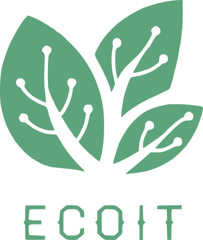

# EcoDevIt

## Présentation
C’est un fait, la crise écologique est devenue une urgence majeure. La sixième extinction 
massive a déjà commencé et le changement climatique se fait de plus en plus ressentir au fil 
des années. Mais qu’en est-il d’internet ?

En matière d’émissions de CO2, il pollue 1.5 fois plus que le transport aérien. D’ailleurs, en 20 
ans, le poids d’une page web a été multiplié par 115 (source : https://www.greenit.fr/)
Face à ce constat, un organisme de formation a été fondé en 2017 : EcoDevIt. Son objectif est 
d’être une plateforme d’éducation permettant à tout instructeur expert en accessibilité et en 
éco-conception web de présenter des modules de cours.

À terme, EcoDevIt désire devenir la référence française pour les développeurs soucieux de leur 
impact digital. Et pourquoi pas délivrer enfin un label officiel pour classer les sites web selon 
leur empreinte numérique.

## Environement de développement

### Prérequis

Pour le déploiement local de ce projet, il est conseillé d'utiliser l'environnement de développement suivant pour isoler le contexte et assurer une compatibilité maximum

Installer WSL 2 - Distribution Ubuntu
[Documentation officielle](https://docs.microsoft.com/fr-fr/windows/wsl/install-win10)

Installer les packages et librairies
<pre>sudo apt-get install autoconf automake bison build-essential curl git-core libapr1 libaprutil1 libc6-dev libltdl-dev libsqlite3-0 libsqlite3-dev libssl-dev libtool libxml2-dev libxslt-dev libxslt1-dev libyaml-dev ncurses-dev nodejs openssl sqlite3 zlib1g zlib1g-dev libreadline8</pre>

Installer RVM (Ruby version manager)
<pre>curl -L get.rvm.io | bash -s stable</pre>

Installer Ruby
<pre>rvm install 2.7.4</pre>

Installer Rails
<pre>gem install rails -v 5.2.7</pre>

Normallement, tout est prêt. 

Sinon, rien de tel que les documentations officielles! 😉

### Déploiement local

1. Cloner le dépot
<pre>git clone git@github.com:WilfriedPaillot/ecoit.git</pre>

2. Naviguer vers le dossier projet
<pre>cd ecoit</pre>

3. Installer les dépendances
<pre>bundle install</pre>

4. Créer les bases de données de développement
<pre>rails db:create</pre>

5. Appliquer les fichiers de migration
<pre>rails db:migrate</pre>

6. Alimenter les tables de données de test (seed)
<pre>rails db:seed</pre>

### Lancer le server

<pre>rails server</pre>

## Liens

* Hébergé sur Heroku: [Website](https://ecodevit.herokuapp.com/)

* contact: [linkedin](https://www.linkedin.com/in/wilfried-paillot/)

* Toutes les informations liées au projet sont consultables sur le [wiki](https://github.com/WilfriedPaillot/ecoit/wiki)

Développé avec :green_heart: par Wilfried PAILLOT